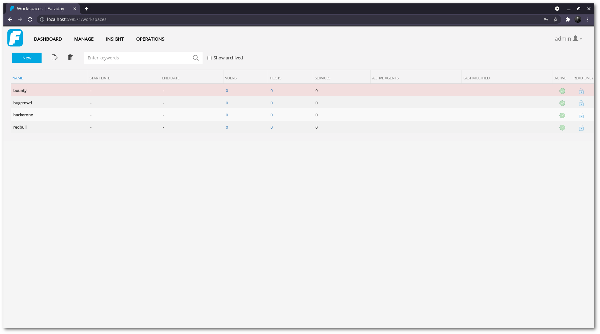

# Faradaysec Docker

Faradaysec app with docker

[Faradaysec](https://faradaysec.com/)

Technologies used in this app:

- [Docker](https://docs.docker.com/)
- [PostgreSQL](https://www.postgresql.org/)

## Dependencies

- [Docker](https://docs.docker.com/)
- [Docker-Compose](https://docs.docker.com/compose/)

### Run the machine

 ```sh
 docker-compose up -d
```
happy fun :)

<p align="center">
	
</p>

<h6 align="center">
	<a href="https://goo.gl/EHhrcC">MIT</a>
	©
	Wellington Moraes
</h6>
